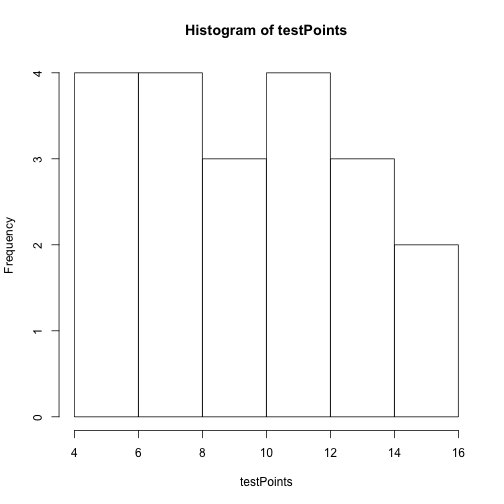

# 第2章 1つの変数の 記述統計

## 2.1 1 つの変数の要約

データが一杯ある時、 *平均* という形に要約したりする。
このデータの持つ特徴を1つの数値にまとめる事を *数値要約* という。

## 2.3 変数の種類

統計解析上、変数の意味合いが違うものがある

- 質的変数
  * 好き or 嫌い 、男 or 女 みたいな分類をする変数のこと
  * 2択なら2値変数とかいったりする
  * こちらは平均とか計算できない
- 量的変数
  * 点数とかの数値みたいなものを表す変数
  * 大小を扱う問題の変数

質的変数は平均とか出せないので、変数の意味によって統計解析の手法は変わるという話

## 2.4 データの視覚的表現

`変数名` には英数字と`.`が使える


```r
指導法 <- c("C", "B", "B", "A", "B", "C", "A", "D", "D", "D", "A", "A", "A", 
    "C", "B", "D", "C", "C", "B", "D")
```


### 度数

同じカテゴリに含まれるデータの個数を **度数** という。
度数をまとめたものを *度数分布* といって、 `table()` は度数分布の表を表示する関数


```r
table(指導法)
```

```
## 指導法
## A B C D 
## 5 5 5 5
```


A,B,C,Dがそれぞれ何個づつ含まれてるかが表示される。

### ヒストグラム

量的変数を度数ごとにグラフでしめしたものを **ヒストグラム** という。

度数分布図とか言われるらしい


```r
testPoints <- c(13, 14, 7, 12, 10, 6, 8, 15, 4, 14, 9, 6, 10, 12, 5, 12, 8, 
    8, 12, 15)
hist(testPoints)
```

 


## 2.5 平均とは

複数の値があった時に、それが全体的にどうなのかが分かりにくいのでデータの代表値を出すことがある。

平均もこの代表値の一種。

$平均=(i1 + i2 + ... + in)/n$

愚直にやると以下のような感じで平均を求められる。


```r
testData <- c(10, 13, 8, 15, 8)
sum(testData)/length(testData)
```

```
## [1] 10.8
```


でも、Rは平均を求める `mean()` 関数があるので、以下みたいに書ける(meanは平均って意味がある)


```r
mean(testData)
```

```
## [1] 10.8
```


## 2.6 平均以外の代表値

_代表値_ として 平均はよく使われるが、他にも *中央値* や *最頻値* なども代表値として使われる。

### 中央値

`median()` でデータをソートして丁度真ん中にあるデータを示す *中央値* が求められる。


```r
median(testData)
```

```
## [1] 10
```


中央値を求めるときに偶数個なら、真ん中の2つの平均を取った値が出る


```r
evenNumbers <- c(1, 2, 3, 4)  # 偶数個
median(evenNumbers) == mean(c(2, 3))
```

```
## [1] TRUE
```


### 最頻値

最も頻繁に観測される値の事。
Rには最頻値を求める関数はないが `table()`で見れば分かる


```r
table(testData)  # 度数を見れば最頻値がわかる
```

```
## testData
##  8 10 13 15 
##  2  1  1  1
```


最頻値は複数の値が出てきしまう事があるが、代表値はひとつが望ましいので、複数あるときは他の代表値を使ったほうがいい感じ。

### まとめ

代表値のどれ使うかの考え方

* 量的変数は大体平均値
* 他の値が大きく離れた値があるときは中央値
* 質的変数は最頻値

## 2.7 散布度

代表値はあくまで代表的なものを示すだけなので、分布的なものはそれだけだとわからない。

そういう時に、データの散らばり度合いである  *散布度* を見て特徴をつかむ。
数値要約 => 代表値と散布度を求める

## 2.8 分散、標準偏差とは

### 分散

散布度の一種である分散を求めてみる。(標本分散)

分散は次のような式で表せる

$分散= ((データ1 - 平均)^2 + (データ2 - 平均)^2 + ... + (データn - 平均)^2)/n$


```r
testDataMean <- mean(testData)
平均からの偏差 <- testData - testDataMean
print(平均からの偏差)
```

```
## [1] -0.8  2.2 -2.8  4.2 -2.8
```


`testData` から それぞれ平均値である `10.8` を引いたものがベクトルに入ってる。 各データから平均を引いたものを *平均からの偏差* といって、
つまり分散は以下のようにも書ける。

$分散= sum(平均からの偏差^2)/n$

この式の通り計算すれば、分散は以下のようになる


```r
分散 <- sum(平均からの偏差^2)/length(testData)
print(分散)
```

```
## [1] 7.76
```


### 標準偏差

散布度の指標として一番使われるのが標準偏差で、
この値が大きいほどデータが散らばってるという意味になる。

分散から標準偏差を求める式は以下のようになる。

$標準偏差 = √分散$

分散から平方根を外せばいいので、平方根を求める `sqrt()` 関数で標準偏差が出せる


```r
sqrt(分散)これが標準偏差
```

```
## [1] 2.786
```


### まとめると

1. 標本分散を求めた
2. 標準偏差を標本分散から出した

### 不偏分散

Rにある分散を求める `var()` は不偏分散を求める関数で
これは標本分散とは割る値が違うので、違った値がでる


```r
var(testData)  # 不偏分散
```

```
## [1] 9.7
```


* 標本分散 は 個数 で割る
* 不偏分散 は 個数 - 1 で割る(プログラミングっぽい)

$標本分散 <- 不偏分散*(データ数-1)/データ数$

ソフトウェア的には不偏分散を使うのが一般的でRの関数もそっちを基本的に使ってる。

> それは、多くの研究では手元のデータが母集団の一部、すな わち標本であり、標本の値から母集団の値を推測することが多いからです。このよ うにデータの背後に母集団を想定し、母集団の値を推測する場合に不偏分散を使い ます。一方、手元に全てのデータがあり、そのデータ自体がどの程度散らばってい るのか、とデータを記述する場合には標本分散を使います。

散布度に分散じゃなくて標準偏差を使うのは、
分散は2乗した値なので、平均とかの代表値と一緒に並べるときは、
同じレベルにしたいので平方根を取り除いた標準偏差を使うとの話

* [分散と標準偏差の違いは？：3次元公差マネジメントツール CETOL6σ：サイバネット](http://www.cybernet.co.jp/cetol/kousa/kousa7.html "分散と標準偏差の違いは？：3次元公差マネジメントツール CETOL6σ：サイバネット")

## 2.9 分散、標準偏差以外の散布度

### 平均偏差

平均偏差は、それぞれの値が平均からどれくらいずれてるかを求めた値。
要は、平均偏差は「平均からの偏差」の絶対値の平均ということになる。


```r
平均からの偏差の絶対値 <- abs(testData - mean(testData))
mean(平均からの偏差の絶対値)
```

```
## [1] 2.56
```


### 範囲(レンジ)

レンジは最大値から最小値を引いた値のことらしい


```r
max(testData)  #15
```

```
## [1] 15
```

```r
min(testData)  # 8
```

```
## [1] 8
```

```r
max(testData) - min(testData)
```

```
## [1] 7
```


## 2.10 標準化

*標準化* は平均と標準偏差が特定の値になるように、
全部のデータの値(`testData`)に対して特定の変換を施す事をいう。

標準化された 特定の値 のことを *標準得点* というが、
この時に 平均が0、標準偏差が1 となるように変換して出来た得点を
*z得点* というらしい

$z得点= (データの値 - 平均) / 標準偏差$

### z得点を求める

z得点 には以下が必要

* 平均
* 標準偏差


```r
心理学テスト <- c(13, 14, 7, 12, 10, 6, 8, 15, 4, 14, 9, 6, 10, 12, 5, 
    12, 8, 8, 12, 15)
心理学平均 <- mean(心理学テスト)
心理学標準偏差 <- sqrt(mean((心理学テスト - 心理学平均)^2))
```


ここから、z得点を求めてみると


```r
心理学z得点 <- (心理学テスト - 心理学平均)/心理学標準偏差
print(心理学z得点)
```

```
##  [1]  0.9005  1.2006 -0.9005  0.6003  0.0000 -1.2006 -0.6003  1.5008
##  [9] -1.8009  1.2006 -0.3002 -1.2006  0.0000  0.6003 -1.5008  0.6003
## [17] -0.6003 -0.6003  0.6003  1.5008
```


```r
mean(心理学z得点)
```

```
## [1] -2.754e-18
```


-2.775558e-18 は、- 2.775558 × 10-18 -> - 0.000000000000000002775558 
なので、大体0という感じになってる(浮動小数点数の誤差)

## 2.11 偏差値

z得点が平均0、標準偏差1 に対して、
*偏差値* は平均50、標準偏差10 となるように標準化した標準得点のことを言う。

z得点から偏差値を求められる。

$偏差値 = (z得点 * 10) + 50$


```r
(心理学z得点 * 10) + 50
```

```
##  [1] 59.00 62.01 41.00 56.00 50.00 37.99 44.00 65.01 31.99 62.01 47.00
## [12] 37.99 50.00 56.00 34.99 56.00 44.00 44.00 56.00 65.01
```


## まとめ

データをどうまとめるかについてまとめた章でした
