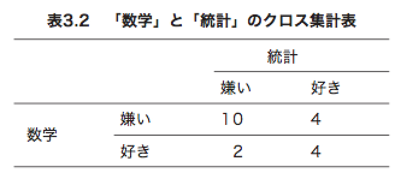

# 第3章 2つの変数の記述統計

質的変数、量的変数同士の関係 を調べる

## 3.1 2 つの変数の関係

> 例えば、国語・英語・数学の 3教科のテストを受験した 100人に ついて、国語の得点と英語の得点のデータを見たところ、「国語の得点が高い人ほ ど英語の得点が高い」傾向にあったとします。

こういう量的変数同士の関係を **相関** という。

|洋食派|和食派|
|----|----|
|甘党が多い|辛党が多い|

洋食派が甘党で、和食派が辛党関係があるような、
質的変数同士の関係を **連関** という

## 3.2 散布図

`x` と `y` という変数について考えて見るときに、それぞれ3パータンの関係がある。

* 変数xがyに比例する
  * => **正の相関**
* 変数xがyに反比例する
  * => **負の相関**
* xの変化がyと無関係
  * => **無相関**

以下のように `plot()` を使うことで散布図を表示できる

```{r}
統計テスト1 <- c(6,10,6,10,5,3,5,9,3,3,11,6,11,9,7,5,8,7,7,9)
統計テスト2 <- c(10,13,8,15,8,6,9,10,7,3,18,14,18,11,12,5,7,12,7,7)
plot(統計テスト1, 統計テスト2)
```

グラフを見れば点が全体として右上がりになってる正の相関があることが見える。

```{r}
心理学テスト <- c(13,14,7,12,10,6,8,15,4,14,9,6,10,12,5,12,8,8,12,15)
plot(心理学テスト, 統計テスト1)
```

*心理学テスト* と *統計テスト* の散布図を見ると円みたいな感じになってて無相関であることがわかります。

## 3.3 共分散

2変数の相関を見るのに散布図を作るのは有用だが、
変数が増えると毎回図にするのは大変。

その時に、図ではなく数値で相関の強さを示す **相関係数** が使える。

相関係数は 標準偏差みたいに共分散から求めるので、
まずは共分散について学ぶ。

### 共分散とは

共分散 = 「偏差の積の平均」(平均からの偏差の積の平均)

なので、偏差の積(x,y)の場合は以下のように表せます。

\[
  \begin{align*}
s_{xy} = \frac{
  (x_1 - \overline{x})(y_1 - \overline{y}) + (x_2 - \overline{x})(y_2 - \overline{y}) + (x_n - \overline{x})(y_n - \overline{y}))
}{n}
  \end{align*}
\]

$$ \overline{y} $$ はyの平均を表す記号で `mean(y)` のこと。

統計テスト1と統計テスト2の共分散を求めてみると以下のようになる。

```{r}
統計テスト共分散 <- sum((統計テスト1 - mean(統計テスト1))*(統計テスト2 - mean(統計テスト2))) / length(統計テスト1)
print(統計テスト共分散)
```

sumをlengthで割ってるので、`mean` に置き換えるのも可能.

R言語では共分散を求める `cov()` という関数があるが、
これは毎度のように不偏共分散を求めるものとなっていて、 `length(統計テスト1)` ではなく、 `length(統計テスト1) - 1` で割ったものとなってる。

```{r}
cov(統計テスト1,統計テスト2)
```

### 共分散の特性

共分散も関係の強さを数値で表すが、測定単位に依存した結果が数値として出てしまう問題がある。

例) 身長と体重

```{r}
身長m <- c(1.5,1.6,1.7,1.8,1.9)
体重 <- c(50,70,60,80,90)
cov(身長m, 体重)
# これに対して身長をcmにした場合
身長cm <- 身長m * 100
cov(身長cm, 体重)
```

同じ意味なはずなのに、 `身長cm` の方が共分散の値が大きくなってしまい、単位に依存した結果が出てしまう問題がある。

この問題を解決するために、標準偏差を使った相関係数がやっぱりいいよねって話になる。

## 相関係数

相関係数は標準偏差で割ったものであり、相関係数は以下のような式になってる。

$s_{xy}$ が前回求めた共分散なので、共分散をそれぞれの標準偏差 $s_{x}$ と $s_{y}$ で割ったものが相関係数となる。

\[
  r_{xy} = \frac{s_{xy}}{s_{x}s_{y}}
\]

(相関係数は測定単位に影響を受けないのは、標準偏差がバラつきの強さを示す値でわっているため?)

以下のように式に関数を当てはめれば求めることができる。

```{r}
cov(統計テスト1, 統計テスト2) / (sd(統計テスト1) * sd(統計テスト2))
```

また、R言語では `cor()` で同じことができるので以下のように書ける

```{r}
cor(統計テスト1, 統計テスト2)
```

`sd()` は不偏標準偏差なので n-1 で割ってる、
不偏共分散を計算する `cov()` はn-1で割ってる。
なので、`cor()` は n-1 同士やってるので、問題なくなってる。

結果得た相関係数は-0.09350516となので、無相関な感じ。

相関係数は0に近いほど無相関で、1になるほど相関関係があるといえる。

### まとめ

* 散布図から相関関係は見える
* 相関係数を求める事で相関関係を標準化した値で示せる
* 相関係数はハズレ値の影響を受けてしまうので散布図自体は有用
(平均を使うので、大きくズレた値があると問題が起きる)

## 3.5 クロス集計表

質的変数の連関についての話。

`table()` は質的変数の度数を表示できるが、複数の変数を渡すことも出来る。

この複数渡した時に表示される表をクロス集計表という(キレイに出ない…)

```{r}
数学 <- c("嫌い","嫌い","好き","好き","嫌い","嫌い","嫌い","嫌い","嫌い", "好き","好き","嫌い","好き","嫌い","嫌い","好き","嫌い","嫌い","嫌い","嫌い")
統計 <- c("好き","好き","好き","好き","嫌い","嫌い","嫌い","嫌い","嫌い", "嫌い","好き","好き","好き","嫌い","好き","嫌い","嫌い","嫌い","嫌い","嫌い")
table(数学, 統計)
```



## 3.6 ファイ係数

量的変数の場合は相関係数を求めて相関関係を数値として示せたが、
2択のような質的変数の場合はどうすればいいでしょうか?という話

そこででてくるのが **ファイ係数** で質的変数を0と1という２値変数に変換して相関係数を求めた値のことをいう。

```{r}
# それぞれ1か0に変換する
MathOneOrZero <- ifelse(数学 == "好き", 1 ,0 )
StatsOneOrZero <- ifelse(統計 == "好き", 1 ,0 )
cor(MathOneOrZero,StatsOneOrZero)
```

ファイ係数を求めてみると0.4弱なので弱い相関があることがわかります。
ただし、ファイ係数だけだとよくわからないことが多いので、クロス集計表の各度数も一緒に見たほうが、質的変数にどういう相関があったのかが分かりやすいです。

## 練習問題

> exercises.R
