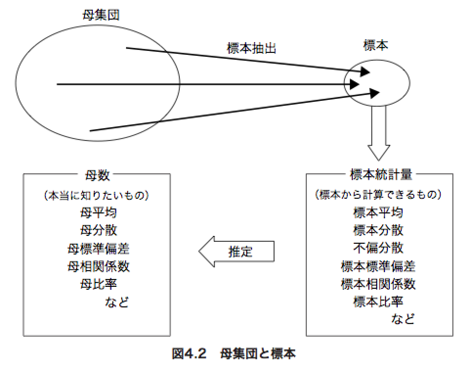
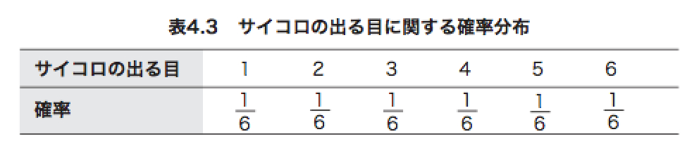

# 第4章 母集団と標本

これまでは、母数も分かってるデータからのデータの様子を見てきたが、
次は一部のデータから集団の性質を推測する統計について。

## 4.1 母集団と標本

元々の関心の対象であったデータ全体を **母集団**、
その一部を取り出したデータを **標本** といって、
母集団から標本を取り出すことを **標本抽出** という。

また、母集団の性質を表す統計的指標(比率、平均、分散、相関関数等)を母数という。

今までやってきたのは母数を求める方法であり、標本ではなく母集団を使ってだしてた。
現実的に母集団が無いデータは多いので、一部(標本)を使って統計して母数を推測する話。

## 4.2 推測統計の分類

### 推測って何?

**推測統計** の手法は **推定** と **検定** の2つに分類されます。

細かく分類すると以下のようになる。

- 推測統計
  - 推定
  - - 点推定
  - - 区間推定
  - 検定

**推定** は具体的な数値を用いて母数の値を推定する事で、点推定と区間推定がある。

- 点推定
  - 60点といったような1つの値を推定する
- 区間推定
  - 50-70点という幅を持った区間を推定する

**検定** は母集団について異なる立場の2つの主張(仮説)をだして、どちらかを採択するかを決めるというものです。

この章は 推定 の方についての話

## 4.3 点推定

### 4.3.1 点推定の手順

ここでは、17歳男性10人のサンプルサイズの標本を使って母数を点推定していく。

`n` を標本の大きさ（サンプルサイズ)として平均を推定してみる。

```{r}
身長 <- c(165.2, 175.9, 161.7, 174.2, 172.1, 163.3, 170.9, 170.6, 168.4, 171.3)
mean(身長)
```

今まで同じで、単純に標本の平均を求めるだけで、点推定した結果となる。

文脈の違いでやってることは同じ

* 記述統計(いままでのやつ)
  * 数値要約をして代表値を求める
* 推測統計
  * 母数の平均を点推定する
  
## 4.3.2 推定量と推定値

標本データから計算されるものは **標本統計量** という。

標本データから 計算する平均、分散、標準偏差、相関係数などは全て標本統計量となる。

同じ平均でも母集団の平均と標本の平均を区別していう時は、
**母平均** や **標本平均** といったりする。

母平均を推定するために標本平均を計算してたけど、
こういう標本統計量は、母数に対しての **推定量** と言われる。
(推定量の値は推定値と呼ぶ)

* 推定量
  * 計算の式や関数の事
* 推定値
  * 計算結果で得られた数値
  


例えば、以下は
推定量として不偏分散を使って不偏分散値を計算してる。

```{r}
var(身長)
```

## 4.3.3 標本抽出に伴う誤差

標本統計量を出すのが意外とシンプルだったけど、
実際にやるときに重要なのは「実際の母数の値にどれくらい近い推定値を出せるか」や「推定の結果はどれくらい信用できるか」という話になります。

母集団が10つのデータあって、標本が5つのデータの場合、
母平均と標本平均には誤差が出てきます。

こういう誤差は標本誤差とよばれて、誤差の大きさがどれくらい許容されるかはケースバイケースになります。

なので、どういう推定値が得られる可能があるかを知る必要があって、
これに対して重要な概念が**標本分布**というものがあります。

## 4.4 推定値がどれくらいあてになるのかを調べる方法

推定値が問題ないかを調べる方法について

1. 標本抽出の方法としての単純無作為抽出
2. 単純無作為抽出によって得られるデータの性質としての確率変数
3. 確率変数がどのような値をとるのかを示す確率分布
4. 確率分布を用いた母集団の表現としての母集団分布
5. 代表的な母集団分布である正規分布
6. R を使って正規分布の母集団から標本を抽出する方法

### 4.4.1 標本抽出の方法――単純無作為抽出

どうやって母集団から標本を抽出するか?って話。

母集団からどのデータも平等に選ばれる可能性を持ってる標本の抽出方法を**単純無作為抽出**という。

抽出方法として無作為にならないのは問題だけど、抽出した結果に偏りがあるのはまあ問題ないって感じ。

こういうやって抽出された**無作為標本**とよぶ。

### 4.4.2 確率変数

サイコロみたいに実際に得るまで値が決まってない変数を**確率変数**と言って、これは同じ手続きでも結果に再現性がないことが特徴。

無作為抽出も毎回無作為に標本を取るため、毎回の結果に再現性はないので、その変数は確率変数といえる。

### 4.4.3 確率分布

確率変数は実際に結果が出るまで値がわからないですが、得られた値を確立変数の **実現値** という。

また、どのような値をどのような確率でとるかというのを表した分布を **確率分布** とい言います。

例えば、サイコロは各値(各目)が出る確率は1/6となるので、
確率分布は以下のようになります。



統計的な言い方では、「サイコロの出る目」という確率変数は、確率分布に「したがう」といういい方をするみたい。

確率分布は、実際に得られたデータからではなく理論的に決められるモノである。

## 4.4.4 母集団分布

母集団分布とは、母集団に置ける分布を表すものです。

例えば、男女比が2:1の母集団を考える

|性別|男性|女性|
|:-----------|------------:|:------------:|
|比率|2/3 |1/3 |


```{r}
barplot(c(2/3,1/3),names.arg=c("Man","Woman"))
```


この母集団から `n=1` サンプルサイズが1の標本を無作為抽出するとします。
この時に抽出されて男女比率は母集団の分布と同じく 2:1になるというのは当たり前になると思います。

これから分かることは、無作為抽出を行う場合標本として抽出される1つのデータに関する確率分布は、母集団分布と同じになるという事が導き出せる。

無作為抽出ではない場合は、その抽出方法に依存するの確率分布はよくわからなくなる。

## 4.4.5 正規分布

統計学で最も使われる確率分布に一つが **正規分布** 。

正規分布は左右対称の釣り鐘型のグラフになる分布で、
現実的にも偶然的にしばしば見られるので、一般的な質的変数の母集団分布としてとりあえず仮定される場合が多い。

```{r}
curve(dnorm(x,mean=0,sd=1),from=-4,to=4)
```

正規分布は平均と分散(あるいは標準偏差)がわかればどのような分布になるのかが一意に定まります。

平均が $μ$ (ミュー) 、分散が $σ^2$ (シグマ二乗) の正規分布は
$N(μ,σ^2)$ と表現します。

ある確率変数X が 正規分布 $N(μ,σ^2)$ に従う時 $X〜N(μ,σ^2)$ と書く。
(Nは正規分布(Normal distribution)の意味)

もう一度、以下の正規分布を見てみる

```{r eval=FALSE}
curve(dnorm(x,mean=0,sd=1),from=-4,to=4)
```

`curve()` は 引数で渡された関数式 `dnorm(x,mean=0,sd=1)` を `from` から `to` までグラフで描画する関数です。

平均(0)が山の頂点となり、標準偏差が分布の横の広がりを示します。
`dnorm` は確率密度関数なので曲線の数式みたいなもの。

グラフを重ねて書くには `add=TRUE` を渡せば出来る。

```{r}
curve(dnorm(x,mean=1,sd=1), add=TRUE)
curve(dnorm(x,mean=0,sd=2), add=TRUE)
```

ある正規分布に従う確率変数の実現値が ある特定の値に入る確率は、
その正規分布の値域の面積が該当するとか。

## 4.4.6 正規分布について少し詳しく

正規分布の標準偏差が何を表してるか、
確率を面積で表す仕組みと確率密度について。
また `dnorm` は確率密度関数と呼ばれるものであるはなしについて。

## 4.4.7 正規母集団から単純無作為抽出を行う

母集団が正規分布であるものを **正規母集団** といいますが、
正規母集団から無作為標本を抽出する話。

平均が50 、標準偏差が10 の正規母集団から $n=5$の標本を無作為抽出する場合、Rでは `rnorm()`を使うことで簡単に出来ます。

$N(50, 10^2)$

```{r}
rnorm(n=5, mean=50, sd=10)
```

無作為抽出なので、実行する度にランダムな感じの値が取得出来ます。

この標本からhistでヒストグラムを作ってみると、正規分布っぽくないようなグラフが出来てしまいます。

```{r}
標本 <- rnorm(n=5, mean=50, sd=10)
hist(標本)
```

これは標本のサイズが小さいからで、確率変数は正規分布に従いますが、ヒストグラムをみただけだとわからない感じがします。

「抽出されたデータが正規分布に近い形になってるかどうか」という結果から、ある確率変数が正規分布にしたがってるかどうかというのは保証されるわけじゃないというのが分かる。

ただし、サンプルサイズをある程度多くすれば、標本データのヒストグラムも正規分布に近くなっていく。

```{r}
大標本 <- rnorm(n=10000, mean=50, sd=10)
hist(大標本)
```

## 4.5 標本分布

標本平均や標本分散等の標本統計量に関する確率分布のことを **標本分布** とい言います。

標本統計量は標本の値が決まって初めて出るものですが、確率変数の値は再現性がないという話もあったので、確率変数から計算して出される平均等も再現性がない _確率変数_ であると言えます。

標本分布はその確率変数である標本統計量がどのような値を取りやすく/取りにくいか を確立で表すもので、母数の推定値がどれくらいあてになるかを知るのに重要な役割を果たします。

凄い紛らわしいけど、
標本分布は、実際の値を示した度数分布ではなく、母集団と標本統計量かとサンプルサイズから数式的に導き出せる分布の事！！

## 4.5.1 標本分布から何が分かるのか

標本分布からどう読み取るかの話。

標本分布は確率変数なので、幅が広かったり(先ほどの例で言うなら標準偏差の値が多い)、母数の本当の値とずれてる位置に平均等がきたりすると、その推定値はあまりあてにならないものといえます。

標本分布を見るときの注意点

1. 標本分布が母数の本当の値を中心として分布しているか
2. 標本分布が横に多く広がってないか

という2点が挙げられる。

この2点はそれぞれ、平均と標準偏差を調べる事で分かるはず。

## 4.5.2 標本分布を「経験的」に求める

経験的 = 現実に得られたデータに基づいて

標本分布は数式で理論的に決まるわけだけど、結構複雑なので、
サンプルサイズを大きくしたり、標本を何回も取得して値を取っていけば似たような形になることもあることがあります。

この経験的に得られるヒストグラムはあくまで近似的に、「理論的な標本分布」を再現する感じなので、完全に標本分布と一致するわけではないことに注意。

経験的に標本分布を求める場合、以下の要素が必要になります。

* 母集団の分布
* 標本統計量の種類(計算式)
* サンプルサイズ

当たり前ですが、母集団の分布が分かってるなら標本分布を求める必要はないので、母集団分布が何なのかは特定できてない状態になると思います。

そこで、扱いやすい正規分布をとりあえずの母集団分布として仮定して検討します。

## 4.5.3 正規母集団の母平均の推定

母集団分布の母平均推定する実験。

とりあえず、母集団分布は $N(50, 10^2)$ の正規分布にしたがったものであると推定して、サンプルサイズは $n=10$とした時に無作為抽出する例を見ています。

```{r}
sample標本 <- rnorm(n=10, mean=50, sd= 10)
mean(sample標本)
```

標本の平均を出してみると、実際の $mean=50$ とは少しズレた値が出てきます。
この差異を **標本誤差** という。

標本誤差が10なので、最大で10の誤差がでますが、この標本から計算される推定値はあてにならないのか、それともある程度得られやすい結果なのかがよくわからないです。

そこでももっと標本を同じ条件で抽出してどういう推定値がでるかを確認してみます。

## 4.5.4 標本分布を求める

正規分布 $N(50, 10^2)$ の正規母集団から $n=10$の標本抽出を10000回くりかえして母平均の推定値の傾向を見ています。

こういう実験を **モンテカルロシミュレーション** と呼びます。

以下では標本を10000個求めてそれの平均(標本平均)を求めてみます。

```{r}
meanArray = numeric(length=10000)
for( i in 1:10000){
  標本 <- rnorm(n=10, mean= 50, sd=10)
  meanArray[i] <- mean(標本)
}
hist(meanArray)
```

実際に標本平均のヒストグラムを見てみると、わずかに誤差が10より大きくなる場合もありますが、大体は誤差が10以内に収まる事がわかります。

誤差が絶対値5以下がどれくらいでるか見てみます。

```{r}
誤差絶対値5以下 <- ifelse(abs(meanArray - 50) <= 5, "YES", "NO")
table(誤差絶対値5以下)
```

大体88-89%ぐらいは本当の母数の値±5の範囲に治まってる事がわかります。

この結果からどんどん回数を増やしていいけば、推定値がある値の範囲に収まる確率を求めることができそうです。
その確率分布が標本分布となります。

今回のモンテカルロシミュレーションからわかったこと

* 正規分布 $N(50, 10^2)$ の正規母集団から $n=10$の標本抽出を繰り返した
* この時、標本分布は $N(50, 10)$ 、50±10という結果になった

つまり、正規分布 $N(μ,σ^2)$ にしたがう母集団からサンプルサイズ$n$の標本を抽出した時の、標本分布は $N(μ,σ^2/n)$ となることがわかる。

実際に平均と分散を求めてみると、上記で計算した結果と大体おなじになります。

```{r}
mean(meanArray) # μ
var(meanArray) # σ
```

ヒストグラムと標本分布を重ねて表示してみます。

```{r}
hist(meanArray, freq=FALSE)
curve(dnorm(x,mean=50,sd=sqrt(10)),add=TRUE)
```

ここでは単純に両方出すと大きさが違うので重ねて出しても見えなくなってしまうので、 `dnorm(50,mean=50,sd=sqrt(10))` に合わせるために、`freq=FALSE` というオプションをつけています。

```{r}
dnorm(50,mean=50,sd=sqrt(10))
```

は最大でも0.126程度で、ヒストグラムに `freq=FALSE` というオプションをつけるとヒストグラム全体の面積が1となるように縦軸が調整される。

## 4.5.5 不偏性

10000個の推定値の平均値を求めてみると、実際の母平均の値と大体一致することがわかりました。

とりあえず、正規分布の母集団を仮定してやりましたが、実はこれは母集団分布がどんなものであっても成り立ちます。

このように、ある推定量の標本分布の平均が推定しようとしてる母数の値と一致する時、その推定量は **普遍性** があると言います。(不偏であるので、間違いない)

これが、( 1 ) 標本分布 が 母数の本当の値を中心として分布しているか」
に対応する概念だ という話。

## 4.5.6 標準誤差

「(2) 標本分布 が横に大きく広がっていないか」に対応するのが標準誤差というやつです。

**標準誤差**  は推定量の標本分布の標準偏差として定義する。

標準偏差が少ないということはブレが少ないので、運によって結果が大きく左右されないということになるのでよい感じ。

前回得た、$N(50,10^2)$の母集団から $n=10$ の標本を抽出した、その標本平均の標本分布は $N(50, 10)$ だったので、標準誤差は $√10$ ということになります。

標準偏差≒「分布の平均値からの距離の平均」なので、平均的には $√10$(約3.16) 程度の誤差が生じると考えられる。

一般化すると

平均が $μ$ (ミュー) 、分散が $σ^2$ (シグマ二乗) の正規分布は
$N(μ,σ^2)$ に従う母集団から、サンプルサイズ $n$ の標本を抽出した時、

標本平均の標本分布は
\[
N(μ,\frac{σ^2}{n})
\]
となり、
この時の標本誤差は
\[
\frac{σ}{√n}
\]
となる。

この結果から

* 母集団分布の分散(標準偏差)が大きいほど、標本平均の標準誤差は大きくなる。
* 母分散が大きいと無作為抽出した標本の平均値は母平均から外れた値を取りやすくなる
* サンプルサイズが大きいほど、標本平均の標準誤差は小さくなる
* サンプルサイズを大きくすれば、無作為抽出した標本の平均値は母平均に近くなる

という事が言える。

母分散はコントール出来ない場合が多いので、サンプルサイズを大きくすることでより経験的に標準誤差を小さく出来る。

これはたくさんデータを集めれば、より母集団に近くなるので直感的な事が理論的にできてることがわかる。

先ほどの標本の平均をヒストグラムにするやつで、サンプルサイズを10から100に変更してみます。

```{r}
meanArray = numeric(length=10000)
for( i in 1:10000){
  標本 <- rnorm(n=100, mean= 50, sd=10)
  meanArray[i] <- mean(標本)
}
hist(meanArray)
```

誤差が標準誤差が50±4の範囲になって大分小さくなってることがわかります。

今回は、母集団の平均、標本の平均という仮定で標準誤差の式を求めたが、これは平均以外でも適応できて、n=サンプルサイズが大きいと標本平均の標本分布が殆ど正規分布になるというのは **中心極限定理** という定理で証明されてる。

## 4.6 標本平均以外の標本分布

平均以外にも分散や中央値で、標本統計量がどういう標本分布を持つかを調べてみる。

## 4.6.1 標本分散と不偏分散の標本分布

* 標本分散(分母がn)
* 不偏分散(分母がn-1)

不偏分散は母分散の不偏推定量であるという性質を持っているので、
そのかたよりがないことを以下の例を見ながら考えていく話。


それぞれを用いて、母分散を求めてみます。

```{r}
標本分散Array <- numeric(length=10000)
不偏分散Array <- numeric(length=10000)

for(i in 1:10000){
  # 母集団の分布は $N(50, 10^2)$
  標本 <- rnorm(n=10,mean=50,sd=10)
  標本分散Array[i] = mean((標本 - mean(標本))^2) # 標本分散を計算
  不偏分散Array[i] = var(標本) #不偏分散
}

mean(標本分散Array)
mean(不偏分散Array)
```

母集団分布は $N(50, 10^2)$ であるので、分散は $10^2$ のため母分散は100となります。

これに対して、標本分散は約90、不偏分散は約100という結果がでて、不偏分散が母分散と殆ど一致しています。

標本分散は母分散の値の $n-1/n$ 倍 Ninarunode 0.9倍されたものがでている。なので、母分散の推定量としては不偏分散の方がよいという風に言える。

また、標準誤差についても見てみます。

```{r}
sd(標本分散Array)
sd(不偏分散Array)
```

`sd` standard deviation は標準誤差を求める関数で、この場合不偏分散の方が誤差の値が大きくなっていて、標本分散の方が誤差が少ないように見えます。

しかし、標本分散の値には不偏性はないので、何かずれている可能性があります。

ヒストグラムを見てみると、標本/不偏分散どちらも100より少し手前に山が来てる事がわかり、また左右対称ではないことがわかります。

```{r}
hist(標本分散Array, breaks=seq(0,500,10))
hist(不偏分散Array, breaks=seq(0,500,10))
```

実際に値としてどれくらい外れてるのかをみてみたいので、分散の推定値が200以上となった標本がどらくらいあるかを数えてみる。

```{r}
table(ifelse(標本分散Array >= 200, 1,0))
table(ifelse(不偏分散Array >= 200, 1,0))
```

標本分散が200弱に対して、不偏分散は倍近くあることがわかります。

不偏分散は不偏性をもつといういい性質はあるが、過度に大きい推定値を出してしまう可能性もあるという事がわかります。

* 色々注意して見てみよう的な感じ

## 4.6.2 中央値の標本分布

母平均の推定量として標本平均を用いることを例としてやってきたけど、標本統計量は平均以外にも中央値等もあります。

より誤差の小さい推定値を得られやすい推定量(計算の式や関数の事)がないかを見てみるトイウ話。

仮定を飛ばして結果だけ

* 一般に最も標準誤差が小さい標本統計量は平均

## 練習問題


